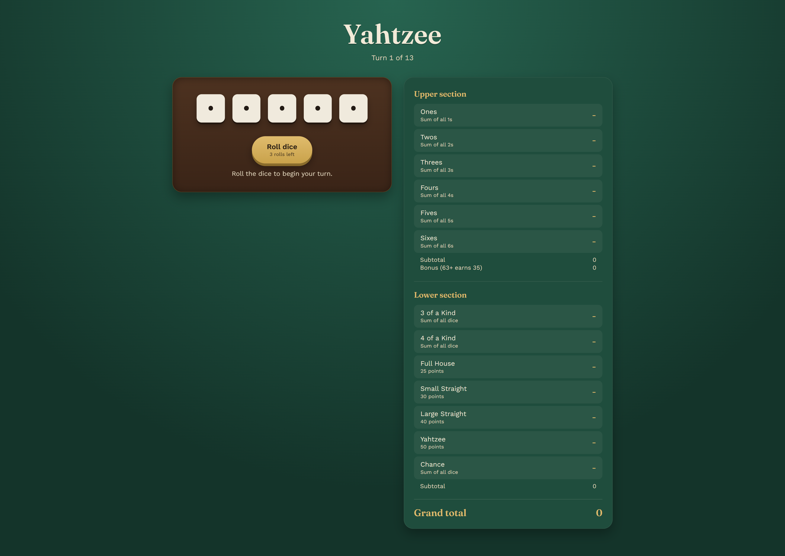

# 🎲 Yahtzee Game

<p align="center">
  A modern and interactive implementation of the classic <strong>Yahtzee dice game</strong>, built using React and Vite.
</p>

<p align="center">

  
  
  
  
  

</p>

---

## 📖 About The Project

**Yahtzee Game** is a modern web-based implementation of the classic dice game.

Players can roll five dice, choose which dice to hold, and roll again up to **three times per turn**. After rolling, the player selects a scoring category and continues until all categories on the scorecard are completed.

The game automatically calculates scores, bonuses, subtotals, and the final score.

---

## ✨ Features

- 🎲 Roll five dice
- 🔄 Maximum of **3 rolls per turn**
- 🔒 Hold and release individual dice
- 📊 Complete Yahtzee scorecard
- ⚡ Live score previews
- 🔢 Automatic score calculation
- ⭐ Upper section bonus for scores of **63 or more**
- 🏆 Final score calculation
- 🎉 Game completion screen
- 🔁 Play again / start a new game
- 📱 Fully responsive design
- 🎨 Modern and clean user interface

---

## 🎮 How To Play

1. Click the **Roll Dice** button to roll all five dice.
2. Click on any dice you want to **hold**.
3. Click **Roll Again** to roll the remaining dice.
4. You can roll a maximum of **three times per turn**.
5. Select a category from the scorecard to save your score.
6. Continue playing until all **13 categories** are filled.
7. The player with the highest final score wins!

---

## 📊 Scoring Categories

### Upper Section

| Category | Description |
|---|---|
| Ones | Total value of all 1s |
| Twos | Total value of all 2s |
| Threes | Total value of all 3s |
| Fours | Total value of all 4s |
| Fives | Total value of all 5s |
| Sixes | Total value of all 6s |

⭐ **Bonus:** Score **63 or more** in the upper section to receive an additional **35 points**.

### Lower Section

| Category | Score |
|---|---:|
| Three of a Kind | Sum of all dice |
| Four of a Kind | Sum of all dice |
| Full House | 25 points |
| Small Straight | 30 points |
| Large Straight | 40 points |
| Yahtzee | 50 points |
| Chance | Sum of all dice |

---

## 📸 Screenshot



---

## 🛠️ Technologies Used

- ⚛️ **React**
- ⚡ **Vite**
- 🟨 **JavaScript (ES6+)**
- 🎨 **CSS3**
- 🌐 **HTML5**

---

## 📂 Project Structure

```text
yahtzee-react-vite/
│
├── public/
│
├── src/
│   ├── main.jsx
│   └── styles.css
│
├── index.html
├── package.json
├── README.md
└── vite.config.js
```

---

## 🚀 Getting Started

### Prerequisites

Make sure you have **Node.js** installed on your computer.

### Installation

Clone the repository:

```bash
git clone https://github.com/ajinkya029/yahtzee.git
```

Navigate to the project folder:

```bash
cd yahtzee
```

Install dependencies:

```bash
npm install
```

Start the development server:

```bash
npm run dev
```

Open the URL displayed in your terminal to view the application.

---

## 📦 Build For Production

To create a production build:

```bash
npm run build
```

To preview the production build:

```bash
npm run preview
```

---

## 🎯 Future Improvements

- 👥 Multiplayer mode
- 🔊 Sound effects
- 🌙 Dark mode
- 🏅 High score system
- 💾 Local storage for game progress
- 🎭 Dice rolling animations
- 🌐 Online multiplayer support

---

## 👨‍💻 Author

**Ajinkya Dhatrak**

Full-Stack MERN Developer

<p align="left">
  <a href="https://github.com/ajinkya029">
    
  </a>
</p>

---

<p align="center">
  ⭐ If you like this project, consider giving it a star!
</p>

<p align="center">
  Made with ❤️ using React and Vite
</p>
